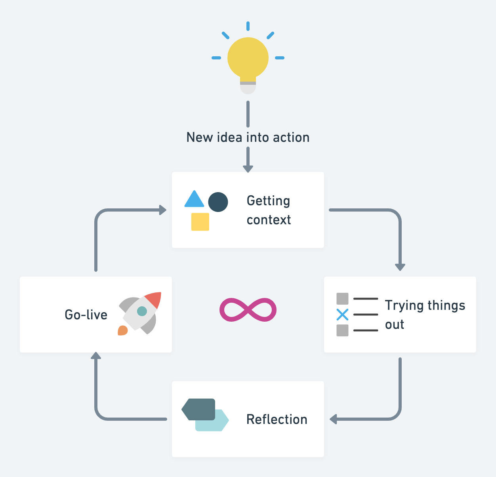

### Story of my life

I just reminded myself about something I used to see in my junior-high-school times. It was a sentence written on a wall in one of the classrooms. It went like this:
>>> I hear, and I forget. I see, and I know. I do, and I understand.

Well, this is so self-explaining sentence! It's easy to hear and then forget about it. Once you read it, you think you know what it means. But only after many attempts of trying various things, you start to understand what it's been about all that time: **DOING**.

I'm keen to learn new things from books and articles I read. Same for courses I watch, and podcasts I listen to. <em class="highlight">Wait a second! Reading, watching, listening to... it's not how I would be able to understand the topic I explore!</em> It'd be good to actually **LEARN** anything from these efforts, right?
 
### Knowledge silo
Let's start with a typical way people learn and solve their problems. That usually was my approach. I used to get things done and not really bother to share a path of finding the solution. Everything would stay in my head. And because of that, I wasn't able to re-think my actions and outcomes. I believe it made me already to forget some of the experience I gained. I can sum that approach as consuming knowledge without creating its improved version myself. 

Although something's changed. Lately, I started to notice that making my knowledge and experience public helps me a lot. It lets me think again and notice what I couldn't see before. Below, I share what I finally started to understand about an optimal learning process. So bear with me and let's move on!

Time to walk through that exciting topic 🚀

### Learn in public
I first read about it at [Swyx's site](https://www.swyx.io/writing/learn-in-public). Long story short: it's about being a knowledge multiplier (more details on the linked page). Anytime you find a new piece of information, you can pass it along. I think we can extend that summary here. You can also add your own interpretation and create unique content, an improved version of the original knowledge. I really like this part ⚡️ That's how innovation begins.

Great! You want to pass the knowledge and experience you have on to somebody, right? But how to teach anyone if you're not really a teacher? Here's the thing that comes for free in the on-line world. <em class="highlight">If you make your findings (notes, code snippets, blog posts, etc.) **public** on the Internet, everyone looking for such piece of information has their chance to see it, and learn from it!</em> Congrats, you're a teacher now, but you don't know your class yet 😎 On a serious note, whatever is shared publically, people can find. Sometimes they learn from it, and it helps them solve their problem. Just give them that opportunity to be your class (<abbr title="also known as">a.k.a.</abbr> audience).

#### Downsides
Not everything is great, though. Getting your ideas public can be scary (at least at the beginning). It was also my case. But hey, that's what I wanted to happen after all. I wanted to [provide value](/how-to-provide-value/) and see if anyone needs it. 😎

>>> Try your best to be right, but don't worry when you're wrong. Repeatedly.
— [@swyx](https://twitter.com/swyx)

I cannot agree more! I know that I keep learning systematically. That's the way I live. My area of interest keeps changing over time. I start learning about the topics I have no clue about, but it doesn’t change my attitude.

#### I did it before... an old-school way
I'd been learning in public, while I was a student. Great times! Here's how it looked like. I graduated from university after studying for 5 years. Over that time, I had to take many exams. Some of them were easier, and some of them were almost impossible to pass. And yet, I made it! 🙃 A secret behind these harder ones was to meet as a group with my folks and prepare together. We were sitting in one room, going through exercises our lecturer shared for the students to prepare. Noone had all the answers. But together, we were able to solve the problems and get the right level of understanding about the particular solution. <em class="highlight">We were looking for information, solving problems, discussing the solutions and sharing among each other.</em> This way, we all made it through these years!

### The cycle
There are a few steps before sharing my learnings in public. I follow them to make the content I create subjective and unique. I also want it to be easy to digest and not too boring. Remember, this is a cycle. It starts with putting a new idea into action.

Staying in that cycle helps me to practice my creativity. I don't always make all the steps in a single cycle. Also, I often swap **Reflection** with **Go live**. It happens when I'm excited about something, or I need to do it quickly. Then, I act first and ask the questions later. But that's OK, there are plenty of cycles to make all the steps the right way.

There's an interesting quote that I read the other day:

>>> Creativity is the brain's invisible muscle.

I wish I knew about it earlier! Although, now I understand it and below is the proof that it works.

#### Getting context
Let's say I want to learn how to present my ideas  clearly. I really do 🙂 I started thinking of what would be required for it to happen. I listed a few ways I came up with so far:
- visual notes taking, by drawing sketchnotes,
- creating mind maps, by going from a high-level perspective into more detailed ones,
- making my presentations logical, by talking first about problems, then about solutions (I tend to do the opposite 🤐).

#### Trying things out
Once I know where to begin, and what are tools I could use, I start playing with them. So far, I've been learning about mind maps. You can try as well — have a glance at [whimsical.com](https://whimsical.com/mind-maps/) examples. The mind map is a simple concept, but if you decide to map a broad idea, you'll end up with a vast diagram. That's where you start seeing how to simplify things!

#### Reflection
Thanks to the mind mapping experience, I noticed that I tend to go into the details too quickly. I think it's because all my professional life I've been looking for solutions. And I'd need to be looking for problems more. It could help me to come up with more alternative solves. That's a great outcome I could only get because of trying the mind maps out. What's more, I discovered sketchnoting, as a more advanced form of the mind map application. I'm getting some context about it now and will soon get into *trying it out*.

#### Go live!
That's the moment I finally have something to share with you. Let's call it [good enough stage](/is-perect-really-good/) ✓ I hope the things I wrote above prove the cycle I'm talking about in this section. I feel really great about finding new ways to form my thoughts and make them available on this blog.

[Here's my space where I share my learnings in details.](https://gist.github.com/tk-o/public) I also encourage you to have a glance on what's happening on Twiter  [#LearnInPublic](https://twitter.com/search?q=%23LearnInPublic). It a nice motivation to start leraning in public, so consider it 🙃

### Quick summary
Below, I present my own list of the most important results to get out of the **learn in public**:

1. **A deeper understanding of a particular problem.** This is where my future self will be most grateful to my past self. I will have a reviewable archive of my work and all of the things I learned about.
2. **Improving communication channels.** I have many ideas. I want to convey them clearly to other people. I don't want these ideas to live only in my mind.
3. **Gaining an audience.** I would be happy if anyone found the content I created helpful. It also could be a way to receive feedback on the learnings I share. What's great about this point is that people will come to me (organic traffic), and I don't even have to reach out.
4. **Building capital.** What I create under my name, it's mine. I have a long-term vision of creating content by taking small steps and repeating them over time.

<em class="highlight">I'm in the cycle!</em>