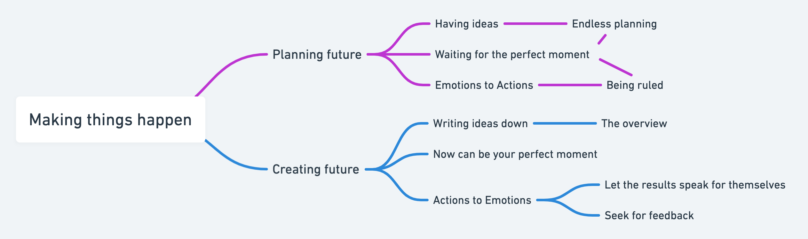

## tl;dr
I encourage you to **get the most out of this article** and read it from top to bottom.
And as always, if you're looking for a shortcut, then miss all the context and [jump directly to **Takeaways**.](#takeaways)

## Time is running

There are three timespans always present in our lives and let's quickly walk through them.

## The past

You can't really change it, as it's all about the events that already happened in your life. What's done it's done.
What you can do, however, is to learn from it. Whether it was a mistake or a success - the past results of your actions will help you make better choices in the future.

And speaking about learning from the past, remember:
> Insanity is repeating the same mistakes and expecting different results.

### The present

This is a relatively short period, and it's tough to say when it starts and ends. I like to think of it as this very moment when you are in a particular state of mind. It ends when you get distracted and jump into another moment.

And that's it. This paragraph has now become the past 😮 Let's move to the next thing!

### The future

This is where all your imagination live. You try planning it, but you never know for sure if you'll be able to reach things you've been wondering about. Many unplanned events happen each day. While not all of them are significant (i.e. missing a train), some of them can change your life forever. These are usually bad things, but you could also win on a lottery, right?

In this text we'll focus on the future, and how to make some of it the present.

## Planning future

It all starts in your imagination. You have some values driving your life, and this allows you to keep dreaming about achieving great things. A bunch of various thoughts — sometimes related, and sometimes not — appear in your head together with each of these dreams.

Some of the dreams, if relevant to you, will become your goals. And you will need something more to enrich your raw goals.

### Having ideas

Every single goal that you've ever imagined also got you wondering on how you could actually reach it, correct? 🙃 You've been thinking many times on how to:
- be happy,
- stay healthy,
- build relationships with people that you care of,
- be successful at work,
- help others,
- go on a holiday to a beautiful place,
- earn more money etc.

Everyone has their goals. You have them too, and it's a good thing!

Although, **many of these goals are only in your head**, aren't they? It may not be true for you, but **that was my case for a very long time**.

### Waiting for the perfect moment

Classic situation. Now is never an option, you'll wait for a better or maybe even for a perfect moment! Yes, the perfect moment! The idea will turn out to be a success, and you won't have to struggle with anything to achieve it! Nope, this won't happen in real life.

Why then people tend to be waiting for some moment in the future? I believe it makes them feel safer because whatever revolutionary (or just new to them) they were about to do, it won't happen now. So they're safe in their comfort zone. And this brings us to the next point.

### When feelings drive actions

Do you recall some situations why you didn't want to do something? Was it because of laziness (i.e. household chores)? Or maybe it was uncertainty when somebody asked you to do a thing you'd never done before (i.e. a completely new task at work)? It's OK to not feel confident, that's a normal thing for all people. You can always refuse or ask to complete the task later. But would this approach help you solve the obstacle and have things done? I'm afraid not.

Letting feelings to drive actions is a risky strategy. Most of the time, you'll feel worried about doing new things because you'd see yourself failing (why so negative?). **This way, you prevent yourself from acting**. Nothing happens, you're in your safe spot.

Remember this: **being afraid of acting will give you no results that you could be proud of**.

## Creating future

All the amazing ideas and goals are virtual until you start making them real. Easier said than done, isn't it? Well, maybe. But for sure it's possible, and I'm going to give you a few examples on how to start **making things happen**! It's all about growing and providing value to others. Speaking of value, make sure to <a href="/how-to-provide-value/">learn what it is, why and how you could create it</a>.

**Either you change the future, or the future will change you.**

### Writing ideas down 

This is so simple and yet so hard. It looks so trivial that it's almost too simple to think of it seriously. And that's the hard part.

Taking notes allows you to see a bigger picture of your mind. That's why I'm writing this very blog post right now. I'm mapping my mind into the articles, so I better see what I actually know of. I trust my eyes better than I trust my memory, and I think most of the people should do the same thing.

There's another advantage of having ideas recorded. You can draw a mind map based on each individual one. Below is my mind map that I've created to organize my thoughts and write this blog post:

I hope it's helpful for you to get my point here 🙂

### Now can be the perfect moment

This is the mindset of a person who executes their plan. You have an idea. Then you have it written down, so you could better see the little details. You do research to make sure you start in somewhat (you don't know it yet) right direction. **You start making things happen!** 🤝

### Let actions drive feelings

I'll use — once again — my blog, for example. I had this dream of being able to share my experience with other people because I believe it could help some of them to develop their skills. Once I decided I'm done with waiting for a perfect moment, I created the blog and wrote <a href="/welcome-friend/">Welcome, friend!</a> post. I didn't know yet if anyone would consider my text interesting, but I wanted to find out.

Since the first post, I stopped being worried about sharing my personal views. Instead, I started focusing on the results: my blog is a platform I use to share my experience with other people. It turned out that trying my idea for real wasn't impossible.

What's even better, some people read what I share, and they like it. Sometimes they also tell me that they enjoyed the article and it helped them. **This is all I wanted!** But to make it happen, I had to start acting, which wasn't that hard and scary after all 🙃 I'm working on improving my platform and provide more ways of leaving feedback.

To me, feedback is a key to improvement — ask for it and don't be anxious about it. It's going to help you fix what's not working.

Remember: **being ready to learn from actions will definitely give you results that you could be proud of**.

<h2 id="takeaways">Takeaways</h2>

1. Having a lot of ideas sound great, but it's your actions that make the difference.
2. Let your actions cause emotions and how you feel, not (as in most cases) the other way around!
3. Taking notes allows you to see a bigger picture of your mind.
4. Have a starting plan and execute it step by step.
5. Look for feedback to improve your plan.
6. **Either you change the future, or the future will change you.**
